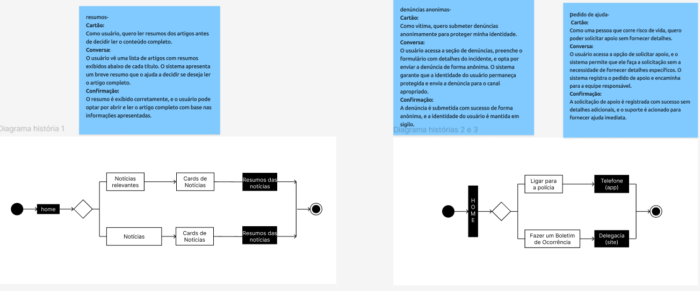
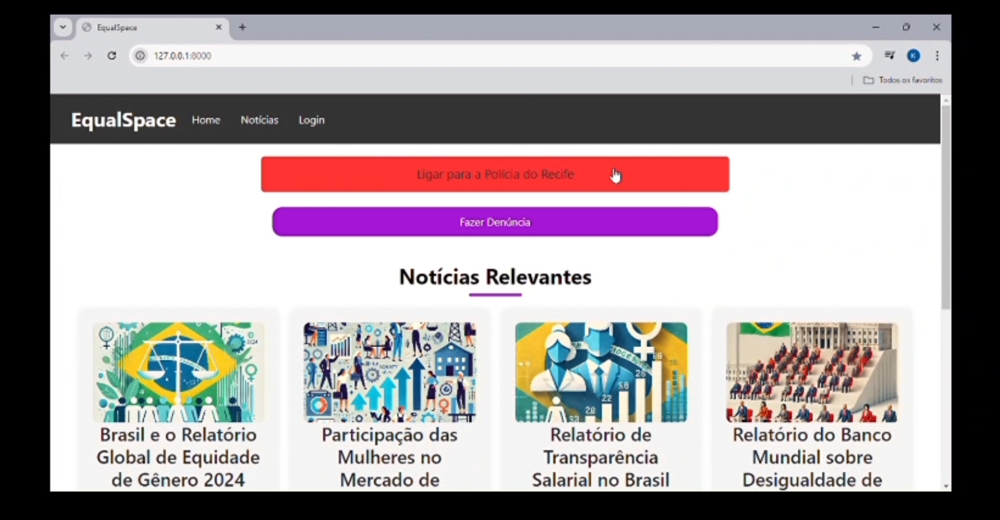

# EqualSpace - Plataforma para a Conscientização e Defesa da Igualdade de Gênero

**EqualSpace** é uma aplicação web dedicada à promoção da igualdade de gênero. A plataforma oferece informações abrangentes sobre temas como direitos, políticas e práticas relacionadas à igualdade de gênero. Também inclui chats interativos, permitindo que os usuários participem de discussões, compartilhem experiências e debatam soluções. O EqualSpace visa criar um ambiente seguro e inclusivo para o diálogo construtivo, promovendo a conscientização e a ação coletiva por um mundo mais igualitário.

---

## ✨ Funcionalidades

- **📚 Biblioteca:** Acervo online com informações que pautam a igualdade de gênero.
- **🚨 Ferramenta de Denúncia:** Permite que vítimas de discriminação solicitem apoio policial direto.
- **💬 Chat Online:** Chat aberto para todos, encorajando discussões sobre os tópicos de igualdade de gênero.

---

## 🚀 Uso

1. Acesse o [site do EqualSpace](#).
2. Cadastre sua conta e realize o login.
3. Explore os fóruns, a biblioteca e participe das discussões!

---

## 🛠️ Tecnologias Utilizadas

- **BackEnd:** Python/Django
- **FrontEnd:** HTML/CSS
- **Banco de Dados:** MySQL

---

## 📜 Licença

Este projeto está licenciado sob a Licença MIT - veja o arquivo [LICENSE](LICENSE) para mais detalhes.

---

## 👥 Autores do Projeto

| Nome                           | Contribuição   | GitHub                                         |
|--------------------------------|----------------|------------------------------------------------|
| João de Medeiros Andrade       | Contribuidor   | [joca-000](https://github.com/joca-000)        |
| Igor José de Alcântara Soares  | Contribuidor   | [IgorSoaresss](https://github.com/IgorSoaresss)|
| Eduardo Américo Bezerra da Silva | Contribuidor | [EduardoAmericoo](https://github.com/EduardoAmericoo) |
| Karoline de Andrade Santiago   | Contribuidora  | [kass200](https://github.com/kass200)          |

---

## 📂 Entrega 1

### 🔄 Gerenciamento de Projeto

- **Quadro Jira:**\
  
- **Backlog:**\
  

### 🎨 Design e Prototipagem

- **Sketches/Storyboards:** [Visualizar no Figma](https://www.figma.com/design/ZO84OXh7OwcOCs1hULaQJt/Untitled?node-id=0-1&node-type=CANVAS&t=nfoZZqEfO8grmmnM-0)
- **Screencast do Lo-fi:** [Acessar no Google Drive](https://drive.google.com/drive/folders/0AAQJ6etTcvP9Uk9PVA)

---
## 📂 Entrega 2

- **Diagrama de Atividades:**\
  \
  [Visualizar no Figma](https://www.figma.com/design/mIlrMwZlRQGVk2sKH0f8dd/Diagrama-de-atividades---Hist%C3%B3ria-3?node-id=0-1&node-type=canvas&t=z12aPCnwxuJEGVA9-0)

- **Screencast:**\
  

### 🔄 Novo quadro de Gerenciamento do Projeto

- **Trello:**\
  \
  [Link para o Trello](https://trello.com/invite/b/6716a746cd4fb3d536346e89/ATTI93e179592852d1de168cf6e6a03e0842BBBAB2BD/equalspace)

  
<strong>Programação em Par</strong>

  [Acessar Pasta](./programacao_em_par/)

---
