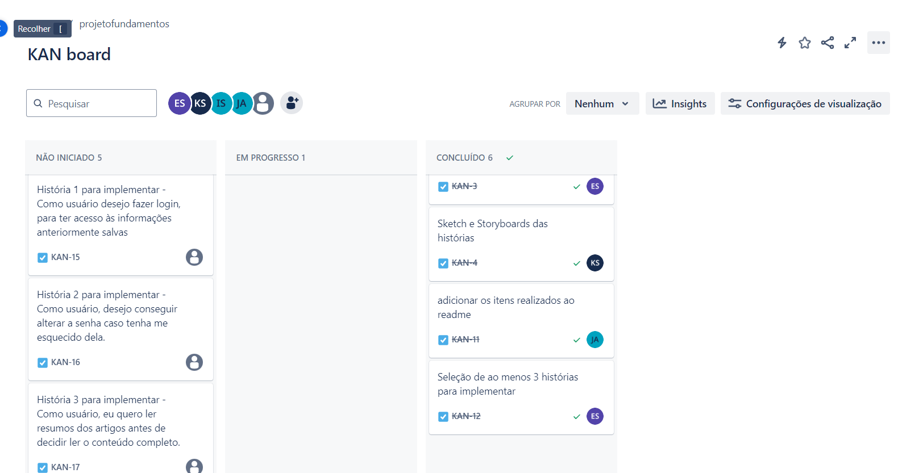

# Equalspace - Uma plataforma criada para conscientizar e juntar defensores da igualdade de gênero

EqualSpace é uma aplicação web dedicada à promoção da igualdade de gênero. A plataforma oferece informações abrangentes sobre temas relacionados à igualdade de gênero, como direitos, políticas, e práticas recomendadas. Além disso, inclui web chats interativos onde usuários podem participar de discussões abertas, compartilhar experiências, e debater soluções para questões de gênero. EqualSpace visa criar um espaço seguro e inclusivo para o diálogo construtivo, fomentando a conscientização e a ação coletiva em prol de um mundo mais igualitário.

## FUNCIONALIDADES

- **bliblioteca:** um acervo online com informações que pautam igualdade de genero
- **ferramenta de denuncia:** 
- **chat online:** um chat online aberto para todos encorajando discussões sobre os topicos

## USO

1. acesse o link -->"o link"
2. cadastre sua conta e faça login
3. explore os foruns e blibliotecas disponiveis

## TECNOLOGIAS UTILIZADAS

- **backEnd:** Python/Django
- **Banco de Dados:** Mysql

## LICENÇA

Este projeto está licenciado sob a Licença MIT - veja o arquivo [LICENSE](LICENSE) para mais detalhes.

## AUTORES DO PROJETO

**João de Medeiros Andrade** - *contribuidor* - [joca-000](https://github.com/joca-000)\
**Igor José de Alcântara Soares** - *contribuidor* - [IgorSoaresss](https://github.com/IgorSoaresss)\
**Eduardo Américo Bezerra da Silva** - *contribuidor* - [EduardoAmericoo](https://github.com/EduardoAmericoo)\
**Karoline de Andrade Santiago** - *contribuidor* - [kass200](https://github.com/kass200)

## AGRADECIMENTOS

## DOCUMENTAÇÃO

 - **sketches/storyboards:** https://www.figma.com/design/ZO84OXh7OwcOCs1hULaQJt/Untitled?node-id=0-1&node-type=CANVAS&t=nfoZZqEfO8grmmnM-0

 - **screencast do lo fi:** 

